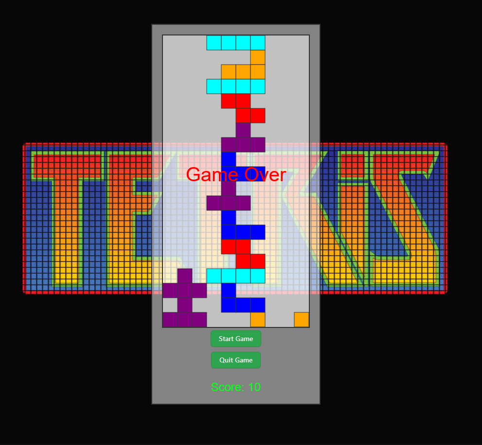

# tetris
Tetris Game 

Documentation 

 

 

The provided code implements a basic Tetris game using JavaScript and HTML canvas. It consists of various functions that handle game mechanics, rendering, and user interactions. Here's a summary of the key functionalities: 

    Initialization and Constants: Defines constants for game elements like canvas size, tetromino shapes, and game board parameters. 

    Drawing Functions: Contains functions to render tetrominos and squares on the canvas. 

    Game Board and Collision: Manages the game board, collision detection, and merging of tetrominos into the board. 

    Game Loop and Control: Controls the game loop for continuous updates and handles falling blocks' movement, rotations, and line clearing. 

    User Input Handling: Listens for keyboard events to control the falling tetrominos (moving left, right, down, and rotating). 

    Game State and Score: Manages game state, updating the score, and handling game over scenarios. 

    Game Initialization and Quitting: Functions to start, reset, and quit the game. 

    Event Listeners: Sets up event listeners for game controls, such as starting and quitting the game. 

    Random Tetromino Generation: Selects random tetrominos for the falling blocks. 

 

 

The game uses a canvas to draw the game elements and continuously updates the game state, allowing players to control falling blocks while clearing lines and scoring points. The code structure follows a modular approach, separating functionalities for better organization and readability. 

The game starts when initiated, processes player input, manages falling blocks, checks for completed lines, updates the score, and handles game over conditions. It provides a basic foundation for a playable Tetris game within a web browser. 

 

 

Functions 

    drawTetromino(tetromino, x, y): 

    Purpose: Renders a tetromino shape on the game board. 

    Parameters: 

    tetromino: The tetromino shape to be drawn. 

    x: X-coordinate on the game board. 

    y: Y-coordinate on the game board. 

    drawSquare(x, y, color): 

    Purpose: Draws a single square block with a specified color on the canvas. 

    Parameters: 

    x: X-coordinate on the canvas grid. 

    y: Y-coordinate on the canvas grid. 

    color: Color to fill the square. 

    isCollision(x, y, shape): 

    Purpose: Checks for collisions between the tetromino and the game board boundaries or existing blocks. 

    Parameters: 

    x: X-coordinate on the game board. 

    y: Y-coordinate on the game board. 

    shape: Shape of the tetromino being checked. 

    mergeTetromino(): 

    Purpose: Merges the current falling tetromino into the game board. 

    rotateTetromino(): 

    Purpose: Rotates the current tetromino shape. 

    Returns: The rotated tetromino shape. 

    moveTetromino(dx, dy): 

    Purpose: Moves the current tetromino left, right, or down based on provided increments. 

    Parameters: 

    dx: X-axis movement. 

    dy: Y-axis movement. 

    clearBoard(): 

    Purpose: Clears the entire game board by resetting all blocks to empty. 

    updateScore(): 

    Purpose: Updates and displays the current score on the game interface. 

    removeFullLines(): 

    Purpose: Identifies and removes any full lines in the game board. 

    Updates: Adjusts the score based on the number of lines removed. 

    startGameLoop(): 

    Purpose: Initiates the game loop and falling block control. 

    startGame(): 

    Purpose: Begins a new game session by initializing game variables and elements. 

    quitGame(): 

    Purpose: Ends the current game session, resetting the game state. 

    getRandomTetromino(): 

    Purpose: Selects a random tetromino shape for the current falling block. 

    controlFalling(): 

    Purpose: Controls the falling motion of the tetromino block. 

    Handles: Movement, collision detection, merging, and line clearance. 

    clearFallingBlockTimeout(): 

    Purpose: Clears the timeout for falling blocks. 

    gameLoop(): 

    Purpose: Controls the game rendering and updating loop, managing the game state and rendering the canvas. 

    isGameOver(): 

    Purpose: Checks if the game is over by verifying the collision of the current tetromino at the top of the game board. 

    handleGameOver(): 

    Purpose: Handles the game over scenario, displaying a "Game Over" message. 

    Event Listeners and Initialization: 

    Purpose: Handles user input (keyboard) and triggers the game start or quit actions. 

 